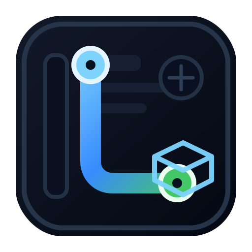
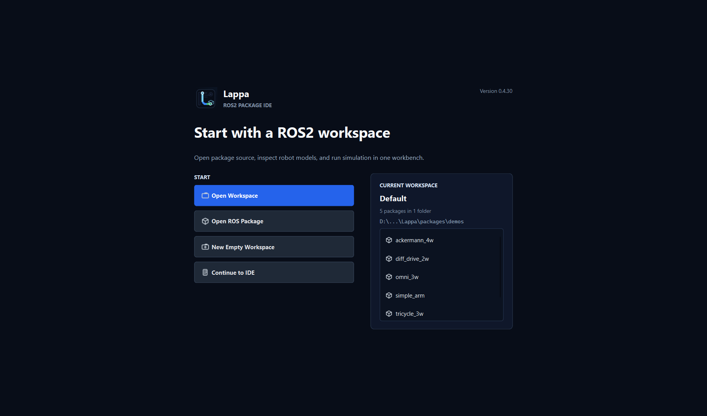
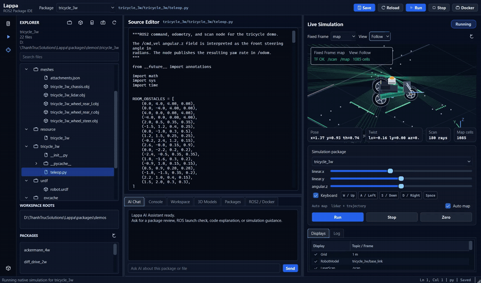

# Lappa

<p align="center">
  
</p>

[](https://www.python.org/downloads/)
[](packages/server/pyproject.toml)
[](packages/server/src/lappa/gui/)
[](https://docs.ros.org/)
[](LICENSE)
[](https://github.com/mergeos-bounties)

**Lappa** is a **desktop ROS2 package IDE**: **open and edit** package sources in the Qt editor, run **offline native simulation**, and optionally **launch the same package in Docker** (`ros2 launch`) so edits mount live into the container — **without installing a full ROS2 desktop on the host**.

| Surface | Role |
| --- | --- |
| **Qt desktop IDE** (`lappa-gui`) | Workspace explorer + text/3D editor + AI chat + simulation |
| **Native sim** | Offline kinematics when Docker is unavailable |
| **Docker** | Real ROS2 distro; bundled sample packages mount into `/ws/src` for IDE↔container bridge |

**Product:** [mergeos-bounties/Lappa](https://github.com/mergeos-bounties/Lappa)

---

## Table of contents

- [Highlights](#highlights)
- [System requirements](#system-requirements)
- [Desktop GUI (Qt) — primary](#desktop-gui-qt--primary)
- [Quick start](#quick-start)
- [CLI reference](#cli-reference)
- [Robot demos](#robot-demos)
- [3D models & packager](#3d-models--packager)
- [ROS2 versions](#ros2-versions)
- [HTTP API (optional)](#http-api-optional)
- [Docker (optional)](#docker-optional)
- [Download binaries](#download-binaries)
- [Diagrams](#diagrams)
- [Repository layout](#repository-layout)
- [Development](#development)
- [MergeOS bounties](#mergeos-bounties)
- [License](#license)

---

## Highlights

| Capability | What you get |
| --- | --- |
| **Package IDE (open/edit)** | Qt package editor — open workspace package trees, edit, Ctrl+S / Save |
| **IDE ↔ Docker bridge** | `lappa docker launch --demo <pkg>` runs `sim.launch.py` on mounted sources |
| **Offline native sim** | Diff-drive, omni, tricycle, ackermann, planar arm — pose, twist, lidar, joints |
| **Lidar obstacles** | Default obstacle map for denser synthetic scans |
| **3D view in editor** | Open OBJ/STL/URDF with text and 3D/wireframe preview in the same editor pane |
| **3D mesh fit** | Procedural OBJ library + AABB fit + multi-link `build-robot` |
| **No host ROS2 required** | Workspace editing + native sim without ROS2 desktop; Docker optional |
| **Multi-distro targets** | Humble · Iron · Jazzy · Kilted · Rolling (Dockerfile rewrite) |
| **Package bundler** | Zip packages with `lappa_manifest.json` for colcon |
| **CLI + API** | `lappa` Typer CLI; FastAPI for IDE automation |

---

## System requirements

| Mode | Requirements |
| --- | --- |
| **Release binary** | Windows 10/11 x64 or Linux x64 (glibc) |
| **Source install** | Python 3.11+ and PySide6 6.6+ |
| **Native simulation** | No ROS2 or Docker installation required |
| **Real ROS2 launch** | Docker Desktop on Windows, or Docker Engine + Compose on Linux |

The first ROS2 image build needs an internet connection and several gigabytes of free disk space. Editing, workspace management, 3D preview, and native simulation remain available when Docker is missing or stopped.

---

## Desktop GUI (Qt) — primary

Lappa’s product surface is a **PySide6** desktop app. Use this path for day-to-day work.

```powershell
cd packages\server
python -m venv .venv
.\.venv\Scripts\activate
pip install -e ".[gui,dev]"

lappa-gui
# or:
lappa gui
```

| Nav page | Purpose |
| --- | --- |
| **Workspace** | Add folders/packages, refresh scan, open package roots discovered by `package.xml` |
| **Editor** | **Open package files, edit, save** from the active workspace package |
| **3D view** | Mesh/URDF files open as text + preview in one resizable editor pane |
| **Simulation** | On-demand ROS2 launch, teleop, RViz-style viewport, lidar, map, TF, and trajectory |
| **3D models** | Build aligned multi-link robot meshes for a demo package |
| **Packages** | List / create colcon-ready zip bundles |
| **ROS2 / Docker** | Distro select, start container, **launch package sim in Docker** |

### First launch

1. Choose **Open Workspace** for a ROS workspace or folder containing multiple packages.
2. Choose **Open ROS Package** for one folder containing `package.xml`.
3. Use **New Empty Workspace** to start with an empty root list.
4. Open the Welcome screen again from the activity rail or with `Ctrl+Shift+H`.

### Desktop polish

- Branded Lappa app icon for the Qt window, taskbar, and Windows release executable.
- Compact IDE layout: activity rail, Explorer tree, center editor, bottom AI Assistant, and an on-demand simulation pane on the right.
- First-run Welcome screen for opening a workspace, ROS package, or bundled sample package.
- The right pane remains idle until **Show Simulation** is clicked; changing packages closes the current session before another package can be launched.
- RViz-style viewport with orbit/top/follow cameras, grid, lidar, trajectory, obstacles, and live ROS2 telemetry.
- Keyboard teleop (`WASD` / arrows, `Space` brake) drives native simulation and forwards `/cmd_vel` to the active ROS2 Docker launch.
- Tricycle mapping demo with a source-derived Xacro chassis, 180-ray lidar, TF, collision-aware autonomous exploration, and ROS2 SLAM Toolbox `/map` output.
- Every bundled mobile/arm demo publishes a runtime snapshot from its real ROS2 Docker node back into the IDE viewport.
- Layered Docker diagnostics for CLI, engine, Compose, image, container health, and ROS2 launch.
- Resizable panes without live repaint flicker while dragging splitters.
- OBJ/STL/DAE/URDF files open as text plus a 3D/structure preview in the same editor pane.

<p align="center">
  
</p>
<p align="center"><em>First-run workspace entry</em></p>

<p align="center">
  
</p>
<p align="center"><em>RViz-style simulation viewport beside the editor and AI assistant</em></p>

### Tricycle SLAM demo

<p align="center">
  <a href="docs/assets/lappa-tricycle-slam-demo.mp4">
    
  </a>
</p>
<p align="center"><em>ROS2 Humble tricycle auto-mapping with 180-ray lidar, collision-safe navigation, TF, and RViz-style Orbit / Follow / Top views. Click the animation for the full MP4.</em></p>

The tricycle Xacro is adapted from [TUPM96/xe_tham_do](https://github.com/TUPM96/xe_tham_do). The warehouse ground-truth occupancy map is sourced from the BSD-licensed [Clearpath Nav2 demos](https://github.com/clearpathrobotics/clearpath_nav2_demos/tree/jazzy/maps); SLAM Toolbox still reconstructs and publishes the displayed `/map` during the run.

<p align="center">
  
</p>
<p align="center"><em>Workspace packages</em></p>

<p align="center">
  
</p>
<p align="center"><em>3D mesh library & build-robot</em></p>

<p align="center">
  
</p>
<p align="center"><em>Package bundles</em></p>

<p align="center">
  
</p>
<p align="center"><em>ROS2 distro & Docker bridge</em></p>

---

## Quick start

### Recommended — Qt desktop

**Windows (PowerShell):**

```powershell
cd packages\server
python -m venv .venv
.\.venv\Scripts\activate
pip install -e ".[gui,dev]"

lappa version
lappa demo
lappa-gui
```

**Linux / macOS:**

```bash
cd packages/server
python -m venv .venv
source .venv/bin/activate
pip install -e ".[gui,dev]"
lappa demo
lappa-gui
```

### Offline smoke (no GUI)

```text
$ lappa demo
demos: 5  (ackermann_4w, diff_drive_2w, omni_3w, simple_arm, tricycle_3w)
3d_robot: diff_drive_2w · links=… · scene_nodes=…
bundle + trajectory CSV · Lappa demo complete
```

### Optional — CLI automation / API only

```powershell
pip install -e ".[dev,api]"
lappa demos list
lappa sim start --demo diff_drive_2w
lappa model build-robot diff_drive_2w
lappa serve --port 8840   # optional local FastAPI automation API
```

---

## CLI reference

| Command | Description |
| --- | --- |
| `lappa version` | Package version (**0.4.30**) |
| `lappa demo` | Offline smoke: engines + 3D robot + bundle + trajectory |
| `lappa gui` / **`lappa-gui`** | **Qt desktop app** (needs `.[gui]`) |
| `lappa demos list` | List robot demos |
| `lappa list-demos --path <root>` | Compatibility scan for repository demo folders |
| `lappa workspace list \| roots \| add \| remove \| new` | Manage multi-package workspace roots |
| `lappa workspace open <path\|name>` | Set active package |
| `lappa sim start --package <path\|name>` | Start native sim for a workspace package |
| `lappa sim start --demo <id>` | Start native sim by sample/demo id |
| `lappa sim status` | Session status |
| `lappa sim trajectory --rich` | Export velocity, acceleration, jerk, and rotation CSV |
| `lappa ros2 list \| set \| get` | Target ROS2 distro |
| `lappa package list \| bundle \| bundles` | Colcon-ready zip packs |
| `lappa model presets \| create \| list` | Procedural OBJ library |
| `lappa model fit` | Auto-scale mesh AABB |
| `lappa model attach` | Fit-attach mesh onto a package link / URDF |
| `lappa model build-robot` | Full multi-link robot (chassis + wheels + lidar) |
| `lappa model scene` | Print `scene3d` JSON for a package |
| `lappa docker status` | Docker availability / distro |
| `lappa serve` | Optional local FastAPI automation API |
| `lappa desktop` | Launch the Qt desktop IDE |

```powershell
lappa demos list
lappa workspace add C:\ros2_ws\src
lappa workspace list
lappa workspace open diff_drive_2w
lappa sim start --package diff_drive_2w
lappa sim start --demo diff_drive_2w
lappa ros2 set jazzy
lappa package bundle -p diff_drive_2w -p omni_3w --distro humble
lappa model build-robot diff_drive_2w
```

---

## Robot demos

Each entry under `packages/demos/` is a **ROS2-style package** (`package.xml`, `launch/`, `urdf/`, Python nodes, `meshes/`).

| Id | Kinematics | 3D layout (`build-robot`) | Notes |
| --- | --- | --- | --- |
| `diff_drive_2w` | Differential drive | Chassis + L/R wheels + lidar | Classic mobile base |
| `omni_3w` | Holonomic 3-wheel | Chassis + 3 wheels @ 120° + lidar | Strafe + rotate |
| `tricycle_3w` | Tricycle | Xacro chassis + steer + rear pair + lidar | SLAM Toolbox warehouse mapping + collision-aware exploration |
| `ackermann_4w` | Ackermann car-like | Chassis + 4 wheels + lidar | Wheelbase + steer |
| `simple_arm` | Planar 2-DOF | Base + link1 + link2 | Joint angles / FK tip |

Offline sim state includes `x, y, theta`, `twist`, synthetic `lidar`, and **`joints`**. When a bundled package is launched through Docker, the same viewport switches to snapshots published by its real ROS2 node; `tricycle_3w` additionally streams SLAM Toolbox `/map`, `/scan`, and `/odom`.

| | |
| :---: | :---: |
|  |  |
| *Qt IDE live simulation beside the editor* | *Desktop mesh and robot tooling* |
|  |  |
| *Workspace package bundle flow* | *ROS2 distro and Docker bridge controls* |

---

## 3D models & packager

### Mesh library & auto-fit

| Preset | Use |
| --- | --- |
| `box` | Generic body |
| `cylinder` | Pillar / vertical body |
| `sphere` | Ball / joint hint |
| `wheel` | Thin cylinder (Y-axis spin) |
| `chassis` | Mobile base plate |
| `arm_link` | Elongated arm segment |
| `lidar_dome` | Hemisphere sensor |

```powershell
lappa model create chassis -n my_chassis
lappa model create wheel -n my_wheel
lappa model fit my_chassis --sx 0.42 --sy 0.30 --sz 0.10
lappa model attach diff_drive_2w my_chassis --auto-fit --link base_link
lappa model build-robot diff_drive_2w
```

**Fit semantics:** parse OBJ → AABB → scale/center → write into `package/meshes/` and upsert URDF visuals.

### Full aligned robot

```text
base_footprint
  └── base_link          (chassis mesh)
        ├── wheel_*      (continuous joints)
        └── lidar_link   (fixed)   # mobile bases
```

### Package bundles

```powershell
lappa package list
lappa package bundle -p diff_drive_2w -p omni_3w --distro humble
lappa package bundles
```

Artifacts under the server workspace (e.g. `.workspaces/bundles/`) include package sources, meshes, URDF, and `lappa_manifest.json`.

---

## ROS2 versions

```powershell
lappa ros2 list
lappa ros2 set jazzy
lappa ros2 get
```

| Id | Image | Notes |
| --- | --- | --- |
| `humble` | `ros:humble-ros-base` | Default LTS (Ubuntu 22.04) |
| `iron` | `ros:iron-ros-base` | Legacy |
| `jazzy` | `ros:jazzy-ros-base` | LTS Ubuntu 24.04 |
| `kilted` | `ros:kilted-ros-base` | Interim |
| `rolling` | `ros:rolling-ros-base` | Bleeding edge |

In **Qt → ROS2 / Docker**, pick the distro. Starting Docker regenerates `packages/docker/Dockerfile` for the selection.

---

## HTTP API (optional)

Base URL when you intentionally run the local automation API with `lappa serve`: `http://127.0.0.1:8840`

Lappa does not ship a browser or web frontend. This loopback API is an optional headless integration surface; the product UI is the Qt desktop IDE.

| Method | Path | Purpose |
| --- | --- | --- |
| `GET` | `/health` | Health + version + demos |
| `GET` | `/api/demos` | Demo package list |
| `POST` | `/api/sim/start` | Start native sim |
| `POST` | `/api/sim/cmd` | Publish twist |
| `GET` | `/api/sim/state` | Pose / joints / lidar |
| `GET` | `/api/sim/trajectory.csv` | Trajectory export |
| `GET` | `/api/ros2/versions` | Distro list + selected |
| `POST` | `/api/packages/bundle` | Create zip bundle |
| `POST` | `/api/models/build-robot` | Full aligned robot |
| `GET` | `/api/packages/{pkg}/scene3d` | 3D scene graph |
| `GET` | `/api/docker/status` | Docker probe |
| `POST` | `/api/docker/start` | Start container (demos → `/ws/src`) |
| `POST` | `/api/docker/launch` | `ros2 launch` active demo in container |
| `POST` | `/api/docker/launch/stop` | Stop launch processes |
| `GET`/`PUT` | `/api/files` | Open / save package files (IDE) |

Prefer the **Qt desktop IDE** for day-to-day package work; the API is for automation.

---

## Docker (optional)

### Load ROS2 and run packages with colcon

Requires [Docker Desktop](https://www.docker.com/products/docker-desktop/) (or Linux Docker).

Docker is **not** a thin shell — it **loads a real ROS2 distro**, **colcon-builds** the ament package you edit in the IDE, then runs:

```bash
ros2 launch <package> sim.launch.py
```

In the IDE, select a package and click **Show Simulation**. Lappa prepares Docker, colcon-builds that package, starts its launch file, and connects the right viewport to its telemetry. The pane is not started at application launch, and selecting another package first tears down the current launch.

The IDE reports each Docker layer separately so setup failures are actionable:

| Status | Meaning | IDE action |
| --- | --- | --- |
| `Missing` | Docker CLI is not installed | Shows the Docker Desktop install action |
| `Engine stopped` | CLI exists but the daemon is unavailable | Shows **Open Docker Desktop** |
| `Image not built` | Engine works but the selected ROS2 image is absent | **Start** builds the selected distro |
| `Starting` | Container healthcheck is pending | Launch stays disabled and status refreshes automatically |
| `Healthy` | ROS2, Compose, image, and container are ready | Active bundled package can be built and launched |
| `Unhealthy` | Container failed its ROS2 healthcheck | Rebuild guidance and diagnostics remain visible |

| Step | What happens |
| --- | --- |
| 1. IDE edit | `packages/demos/<pkg>/…` (Qt Editor) |
| 2. Show Simulation | The selected package owns the right viewport; no package is launched implicitly |
| 3. Docker prepare | Image: `/opt/ros/$DISTRO` + colcon + rclpy/launch; demos are mounted into `/ws/src` |
| 4. Build + launch | `colcon build --packages-select <pkg>` then **`ros2 launch <pkg> sim.launch.py`** |
| 5. Live bridge | ROS2 `/odom`, `/scan`, `/map`, TF, or arm joint state is rendered in the IDE |

```powershell
lappa docker start                          # build/start ROS2 container
lappa docker build --demo diff_drive_2w     # optional: colcon only
lappa docker launch --demo diff_drive_2w    # build + ros2 launch package
lappa docker launch-stop
lappa docker stop
```

Inside the container (debug):

```bash
docker exec -it lappa-ros2 bash
source /opt/ros/humble/setup.bash
/ros2_ws.sh status
/ros2_ws.sh build diff_drive_2w
/ros2_ws.sh launch diff_drive_2w sim.launch.py
ros2 node list
ros2 topic echo /odom
```

Without Docker, **native kinematics sim** still runs offline (`lappa sim start`). Docker is for **real ROS2 package execution**.

---

## Download binaries

Download [Lappa v0.4.30](https://github.com/mergeos-bounties/Lappa/releases/tag/v0.4.30) from GitHub Releases:

| File | Platform |
| --- | --- |
| `lappa-windows-x64.exe` | Windows 10/11 x64 |
| `lappa-linux-x64` | Linux x64 |
| `SHA256SUMS.txt` | SHA-256 checksums for release verification |

```powershell
.\lappa-windows-x64.exe demo
.\lappa-windows-x64.exe gui
```

**Local release build:** [docs/RELEASE.md](docs/RELEASE.md).

```powershell
pwsh scripts\build_release.ps1
# → dist\release\lappa-windows-x64.exe
```

---

## Diagrams

Full-width architecture / workflow. Open HTML for **dark/light** theme.

### Architecture

[Open interactive diagram](docs/diagrams/architecture.html)

<p align="center">
  
</p>

### Workflow

[Open interactive diagram](docs/diagrams/workflow.html)

<p align="center">
  
</p>

*Generated with [archify](https://github.com/tt-a1i).*

---

## Repository layout

```text
packages/
  server/                 # Primary Python package
    src/lappa/
      gui/                # PySide6 desktop (lappa-gui)  ← product UI
      sim/                # Native kinematics engines
      cli.py api.py models3d.py packager.py ...
    tests/
  demos/                  # diff_drive_2w, omni_3w, …
  docker/                 # Optional ROS2 show mode
docs/
  screenshots/            # gui-*.png preferred for product shots
  diagrams/
scripts/                  # release builds
```

**Primary path:** `packages/server` → `pip install -e ".[gui,dev]"` → `lappa-gui`.

---

## Development

```powershell
cd packages\server
pip install -e ".[dev,gui]"
ruff check src tests
pytest -q
lappa demo
lappa-gui
```

---

## MergeOS bounties

Star → claim a bounty issue → PR to **master** → MRG **25–200**.  
Evidence for UI bounties: **Qt desktop screenshots** (`lappa-gui`).  
See [mergeos](https://github.com/mergeos-bounties/mergeos) and [docs/BOUNTY.md](docs/BOUNTY.md).

---

## License

[MIT](LICENSE)
