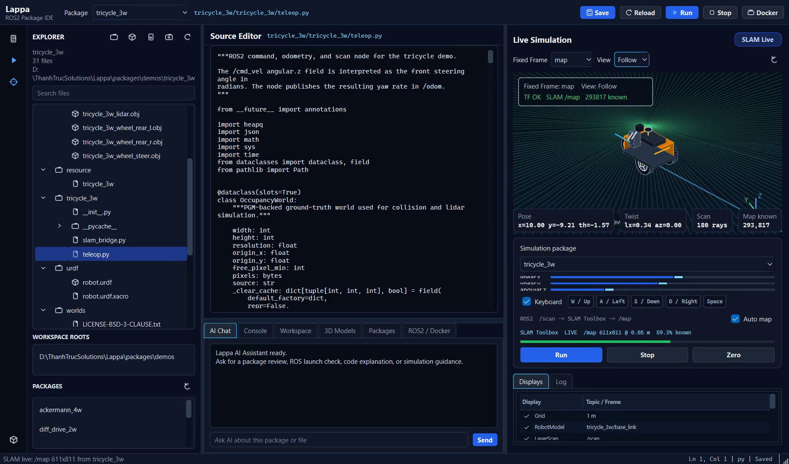
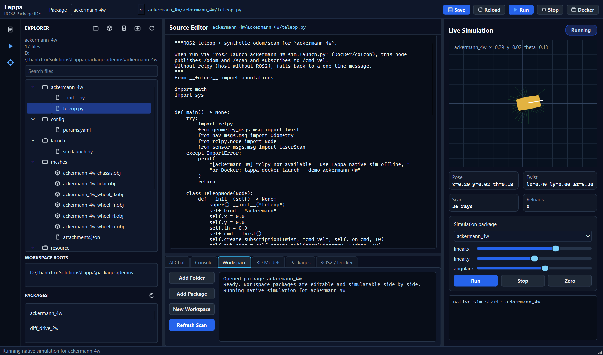
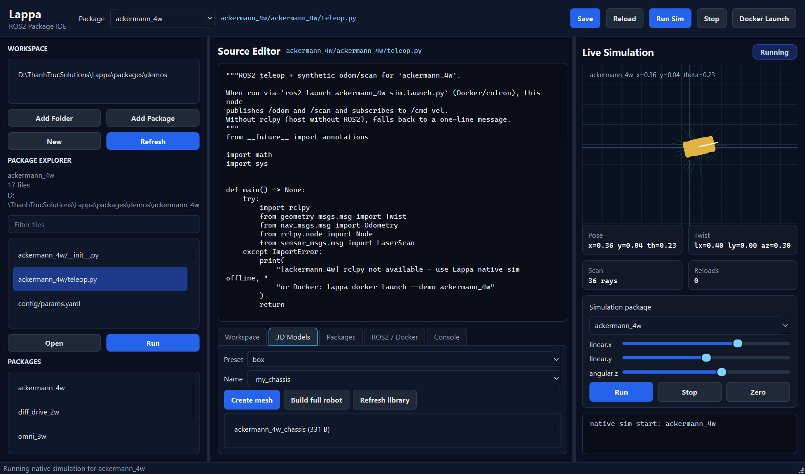
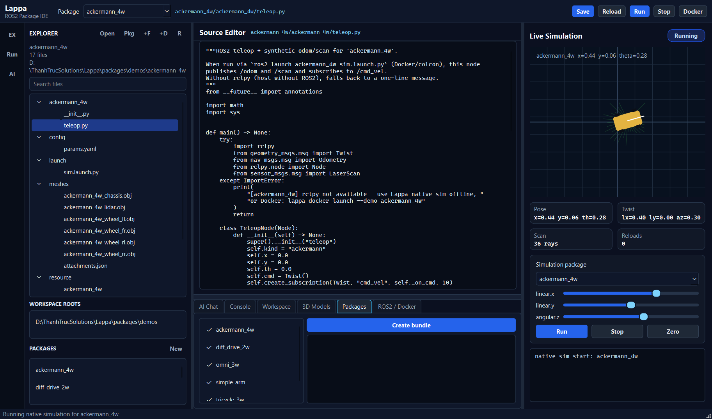
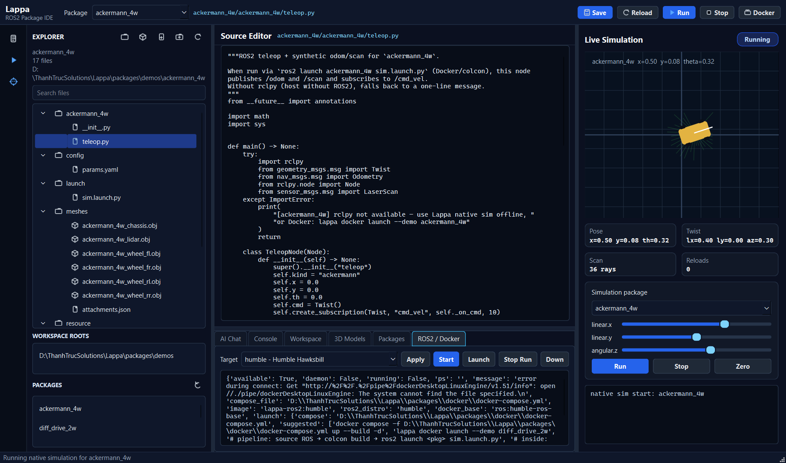
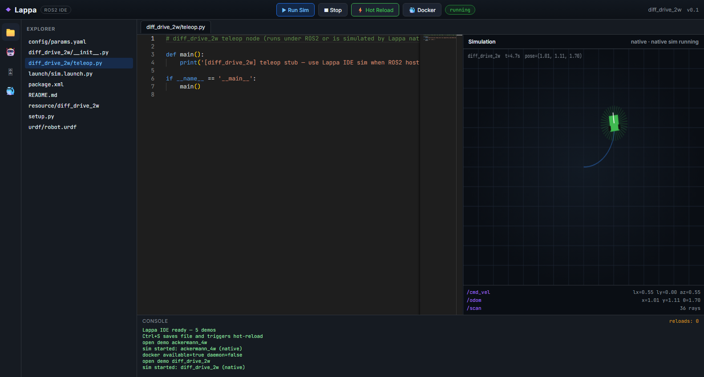
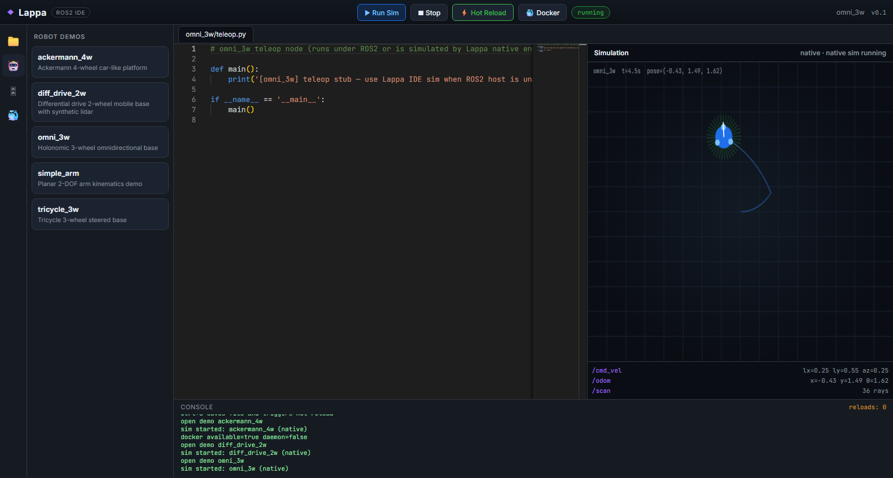
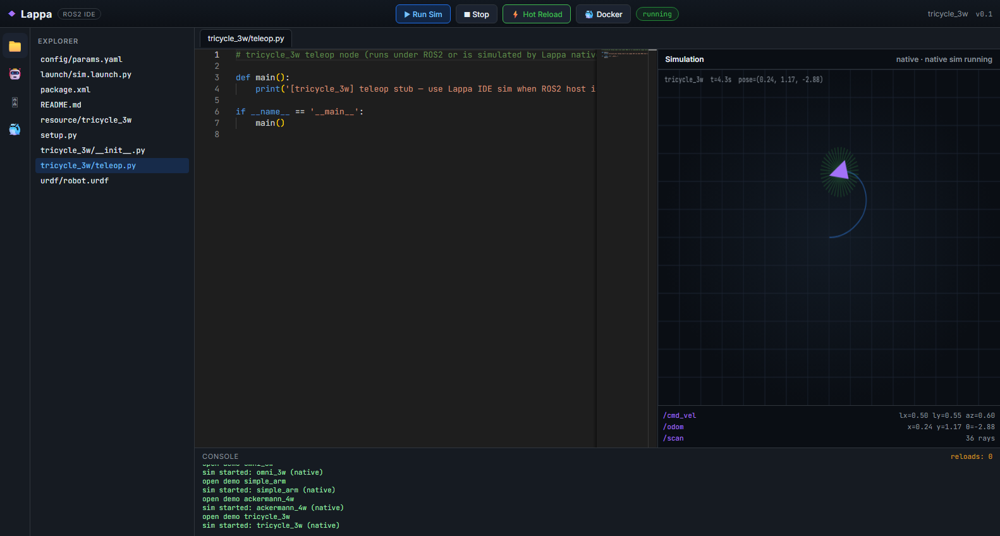
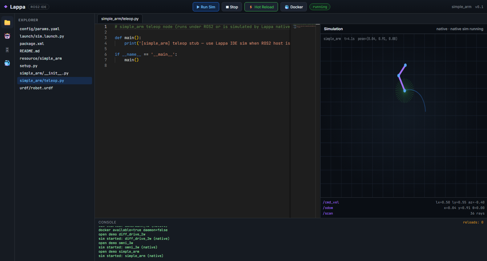

# Lappa

[](https://www.python.org/downloads/)
[](packages/server/pyproject.toml)
[](packages/server/src/lappa/gui/)
[](https://docs.ros.org/)
[](LICENSE)
[](https://github.com/mergeos-bounties)

**Lappa** is a **desktop ROS2 package IDE**: **open and edit** package sources in the Qt editor, run **offline native simulation**, and optionally **launch the same package in Docker** (`ros2 launch`) so edits mount live into the container — **without installing a full ROS2 desktop on the host**.

| Surface | Role |
| --- | --- |
| **Qt desktop IDE** (`lappa-gui`) | Editor page + Simulation + Docker bridge controls |
| **Native sim** | Offline kinematics when Docker is unavailable |
| **Docker** | Real ROS2 distro; `packages/demos` → `/ws/src` for IDE↔container bridge |

**Product:** [mergeos-bounties/Lappa](https://github.com/mergeos-bounties/Lappa)

---

## Table of contents

- [Highlights](#highlights)
- [Desktop GUI (Qt) — primary](#desktop-gui-qt--primary)
- [Quick start](#quick-start)
- [CLI reference](#cli-reference)
- [Robot demos](#robot-demos)
- [3D models & packager](#3d-models--packager)
- [ROS2 versions](#ros2-versions)
- [HTTP API (optional)](#http-api-optional)
- [Docker (optional)](#docker-optional)
- [Download binaries](#download-binaries)
- [Diagrams](#diagrams)
- [Repository layout](#repository-layout)
- [Development](#development)
- [MergeOS bounties](#mergeos-bounties)
- [License](#license)

---

## Highlights

| Capability | What you get |
| --- | --- |
| **Package IDE (open/edit)** | Qt package editor — open demo tree, edit, Ctrl+S / Save |
| **IDE ↔ Docker bridge** | `lappa docker launch --demo <pkg>` runs `sim.launch.py` on mounted sources |
| **Offline native sim** | Diff-drive, omni, tricycle, ackermann, planar arm — pose, twist, lidar, joints |
| **Lidar obstacles** | Default obstacle map for denser synthetic scans |
| **3D mesh fit** | Procedural OBJ library + AABB fit + multi-link `build-robot` |
| **No host ROS2 required** | Demos + editor work without ROS2 desktop; Docker optional |
| **Multi-distro targets** | Humble · Iron · Jazzy · Kilted · Rolling (Dockerfile rewrite) |
| **Package bundler** | Zip packages with `lappa_manifest.json` for colcon |
| **CLI + API** | `lappa` Typer CLI; FastAPI for IDE automation |

---

## Desktop GUI (Qt) — primary

Lappa’s product surface is a **PySide6** desktop app. Use this path for day-to-day work.

```powershell
cd packages\server
python -m venv .venv
.\.venv\Scripts\activate
pip install -e ".[gui,dev]"

lappa-gui
# or:
lappa gui
```

| Nav page | Purpose |
| --- | --- |
| **Editor** | **Open package files, edit, save** — same tree Docker mounts at `/ws/src` |
| **Simulation** | Start/stop **native** sim, teleop, 2D canvas + lidar, trajectory |
| **Demos** | Pick `diff_drive_2w`, `omni_3w`, `tricycle_3w`, `ackermann_4w`, `simple_arm` |
| **3D models** | Build aligned multi-link robot meshes for a demo package |
| **Packages** | List / create colcon-ready zip bundles |
| **ROS2 / Docker** | Distro select, start container, **launch package sim in Docker** |

<p align="center">
  
</p>
<p align="center"><em>Simulation — native kinematics canvas</em></p>

<p align="center">
  
</p>
<p align="center"><em>Robot demos</em></p>

<p align="center">
  
</p>
<p align="center"><em>3D mesh library & build-robot</em></p>

<p align="center">
  
</p>
<p align="center"><em>Package bundles</em></p>

<p align="center">
  
</p>
<p align="center"><em>ROS2 distro & Docker bridge</em></p>

---

## Quick start

### Recommended — Qt desktop

**Windows (PowerShell):**

```powershell
cd packages\server
python -m venv .venv
.\.venv\Scripts\activate
pip install -e ".[gui,dev]"

lappa version
lappa demo
lappa-gui
```

**Linux / macOS:**

```bash
cd packages/server
python -m venv .venv
source .venv/bin/activate
pip install -e ".[gui,dev]"
lappa demo
lappa-gui
```

### Offline smoke (no GUI)

```text
$ lappa demo
demos: 5  (ackermann_4w, diff_drive_2w, omni_3w, simple_arm, tricycle_3w)
3d_robot: diff_drive_2w · links=… · scene_nodes=…
bundle + trajectory CSV · Lappa demo complete
```

### Optional — CLI automation / API only

```powershell
pip install -e ".[dev,api]"
lappa demos list
lappa sim start --demo diff_drive_2w
lappa model build-robot diff_drive_2w
lappa serve --port 8840   # optional local FastAPI automation API
```

---

## CLI reference

| Command | Description |
| --- | --- |
| `lappa version` | Package version (**0.4.25**) |
| `lappa demo` | Offline smoke: engines + 3D robot + bundle + trajectory |
| `lappa gui` / **`lappa-gui`** | **Qt desktop app** (needs `.[gui]`) |
| `lappa demos list` | List robot demos |
| `lappa workspace open <path\|demo>` | Set active package |
| `lappa sim start --demo <id>` | Start native sim session |
| `lappa sim status` | Session status |
| `lappa ros2 list \| set \| get` | Target ROS2 distro |
| `lappa package list \| bundle \| bundles` | Colcon-ready zip packs |
| `lappa model presets \| create \| list` | Procedural OBJ library |
| `lappa model fit` | Auto-scale mesh AABB |
| `lappa model attach` | Fit-attach mesh onto a package link / URDF |
| `lappa model build-robot` | Full multi-link robot (chassis + wheels + lidar) |
| `lappa model scene` | Print `scene3d` JSON for a package |
| `lappa docker status` | Docker availability / distro |
| `lappa serve` | Optional local FastAPI automation API |
| `lappa desktop` | Launch the Qt desktop IDE |

```powershell
lappa demos list
lappa workspace open demos/diff_drive_2w
lappa sim start --demo diff_drive_2w
lappa ros2 set jazzy
lappa package bundle -p diff_drive_2w -p omni_3w --distro humble
lappa model build-robot diff_drive_2w
```

---

## Robot demos

Each entry under `packages/demos/` is a **ROS2-style package** (`package.xml`, `launch/`, `urdf/`, Python nodes, `meshes/`).

| Id | Kinematics | 3D layout (`build-robot`) | Notes |
| --- | --- | --- | --- |
| `diff_drive_2w` | Differential drive | Chassis + L/R wheels + lidar | Classic mobile base |
| `omni_3w` | Holonomic 3-wheel | Chassis + 3 wheels @ 120° + lidar | Strafe + rotate |
| `tricycle_3w` | Tricycle | Chassis + steer + rear pair + lidar | Steering geometry |
| `ackermann_4w` | Ackermann car-like | Chassis + 4 wheels + lidar | Wheelbase + steer |
| `simple_arm` | Planar 2-DOF | Base + link1 + link2 | Joint angles / FK tip |

Sim state includes `x, y, theta`, `twist`, synthetic `lidar` (with obstacles), and **`joints`**.

| | |
| :---: | :---: |
|  |  |
| *Diff drive (legacy web capture)* | *Omni 3W* |
|  |  |
| *Tricycle* | *Planar arm* |

---

## 3D models & packager

### Mesh library & auto-fit

| Preset | Use |
| --- | --- |
| `box` | Generic body |
| `cylinder` | Pillar / vertical body |
| `sphere` | Ball / joint hint |
| `wheel` | Thin cylinder (Y-axis spin) |
| `chassis` | Mobile base plate |
| `arm_link` | Elongated arm segment |
| `lidar_dome` | Hemisphere sensor |

```powershell
lappa model create chassis -n my_chassis
lappa model create wheel -n my_wheel
lappa model fit my_chassis --sx 0.42 --sy 0.30 --sz 0.10
lappa model attach diff_drive_2w my_chassis --auto-fit --link base_link
lappa model build-robot diff_drive_2w
```

**Fit semantics:** parse OBJ → AABB → scale/center → write into `package/meshes/` and upsert URDF visuals.

### Full aligned robot

```text
base_footprint
  └── base_link          (chassis mesh)
        ├── wheel_*      (continuous joints)
        └── lidar_link   (fixed)   # mobile bases
```

### Package bundles

```powershell
lappa package list
lappa package bundle -p diff_drive_2w -p omni_3w --distro humble
lappa package bundles
```

Artifacts under the server workspace (e.g. `.workspaces/bundles/`) include package sources, meshes, URDF, and `lappa_manifest.json`.

---

## ROS2 versions

```powershell
lappa ros2 list
lappa ros2 set jazzy
lappa ros2 get
```

| Id | Image | Notes |
| --- | --- | --- |
| `humble` | `ros:humble-ros-base` | Default LTS (Ubuntu 22.04) |
| `iron` | `ros:iron-ros-base` | Legacy |
| `jazzy` | `ros:jazzy-ros-base` | LTS Ubuntu 24.04 |
| `kilted` | `ros:kilted-ros-base` | Interim |
| `rolling` | `ros:rolling-ros-base` | Bleeding edge |

In **Qt → ROS2 / Docker**, pick the distro. Starting Docker regenerates `packages/docker/Dockerfile` for the selection.

---

## HTTP API (optional)

Base URL when you intentionally run the local automation API with `lappa serve`: `http://127.0.0.1:8840`

| Method | Path | Purpose |
| --- | --- | --- |
| `GET` | `/health` | Health + version + demos |
| `GET` | `/api/demos` | Demo package list |
| `POST` | `/api/sim/start` | Start native sim |
| `POST` | `/api/sim/cmd` | Publish twist |
| `GET` | `/api/sim/state` | Pose / joints / lidar |
| `GET` | `/api/sim/trajectory.csv` | Trajectory export |
| `GET` | `/api/ros2/versions` | Distro list + selected |
| `POST` | `/api/packages/bundle` | Create zip bundle |
| `POST` | `/api/models/build-robot` | Full aligned robot |
| `GET` | `/api/packages/{pkg}/scene3d` | 3D scene graph |
| `GET` | `/api/docker/status` | Docker probe |
| `POST` | `/api/docker/start` | Start container (demos → `/ws/src`) |
| `POST` | `/api/docker/launch` | `ros2 launch` active demo in container |
| `POST` | `/api/docker/launch/stop` | Stop launch processes |
| `GET`/`PUT` | `/api/files` | Open / save package files (IDE) |

Prefer the **Qt desktop IDE** for day-to-day package work; the API is for automation.

---

## Docker · load ROS2 + run package via colcon

Requires [Docker Desktop](https://www.docker.com/products/docker-desktop/) (or Linux Docker).

Docker is **not** a thin shell — it **loads a real ROS2 distro**, **colcon-builds** the ament package you edit in the IDE, then runs:

```bash
ros2 launch <package> sim.launch.py
```

| Step | What happens |
| --- | --- |
| 1. IDE edit | `packages/demos/<pkg>/…` (Qt Editor) |
| 2. `lappa docker start` | Image: `/opt/ros/$DISTRO` + colcon + rclpy/launch; mount demos → `/ws/src` |
| 3. `lappa docker launch -d <pkg>` | `colcon build --packages-select <pkg>` → `source install` → **`ros2 launch <pkg> sim.launch.py`** |
| 4. Topics | Real ROS2 nodes: `/cmd_vel`, `/odom`, `/scan` (or arm joints) |

```powershell
lappa docker start                          # build/start ROS2 container
lappa docker build --demo diff_drive_2w     # optional: colcon only
lappa docker launch --demo diff_drive_2w    # build + ros2 launch package
lappa docker launch-stop
lappa docker stop
```

Inside the container (debug):

```bash
docker exec -it lappa-ros2 bash
source /opt/ros/humble/setup.bash
/ros2_ws.sh status
/ros2_ws.sh build diff_drive_2w
/ros2_ws.sh launch diff_drive_2w sim.launch.py
ros2 node list
ros2 topic echo /odom
```

Without Docker, **native kinematics sim** still runs offline (`lappa sim start`). Docker is for **real ROS2 package execution**.

---

## Download binaries

GitHub Releases may ship standalone builds:

| File | Platform |
| --- | --- |
| `lappa-windows-x64.exe` | Windows 10/11 x64 |
| `lappa-linux-x64` | Linux x64 |

```powershell
.\lappa-windows-x64.exe demo
.\lappa-windows-x64.exe gui
```

**Local release build:** [docs/RELEASE.md](docs/RELEASE.md).

```powershell
pwsh scripts\build_release.ps1
# → dist\release\lappa-windows-x64.exe
```

---

## Diagrams

Full-width architecture / workflow. Open HTML for **dark/light** theme.

### Architecture

[Open interactive diagram](docs/diagrams/architecture.html)

<p align="center">
  
</p>

### Workflow

[Open interactive diagram](docs/diagrams/workflow.html)

<p align="center">
  
</p>

*Generated with [archify](https://github.com/tt-a1i).*

---

## Repository layout

```text
packages/
  server/                 # Primary Python package
    src/lappa/
      gui/                # PySide6 desktop (lappa-gui)  ← product UI
      sim/                # Native kinematics engines
      cli.py api.py models3d.py packager.py ...
    tests/
  demos/                  # diff_drive_2w, omni_3w, …
  docker/                 # Optional ROS2 show mode
docs/
  screenshots/            # gui-*.png preferred for product shots
  diagrams/
scripts/                  # release builds
```

**Primary path:** `packages/server` → `pip install -e ".[gui,dev]"` → `lappa-gui`.

---

## Development

```powershell
cd packages\server
pip install -e ".[dev,gui]"
ruff check src tests
pytest -q
lappa demo
lappa-gui
```

---

## MergeOS bounties

Star → claim a bounty issue → PR to **master** → MRG **25–200**.  
Evidence for UI bounties: **Qt desktop screenshots** (`lappa-gui`).  
See [mergeos](https://github.com/mergeos-bounties/mergeos) and [docs/BOUNTY.md](docs/BOUNTY.md).

---

## License

[MIT](LICENSE)
