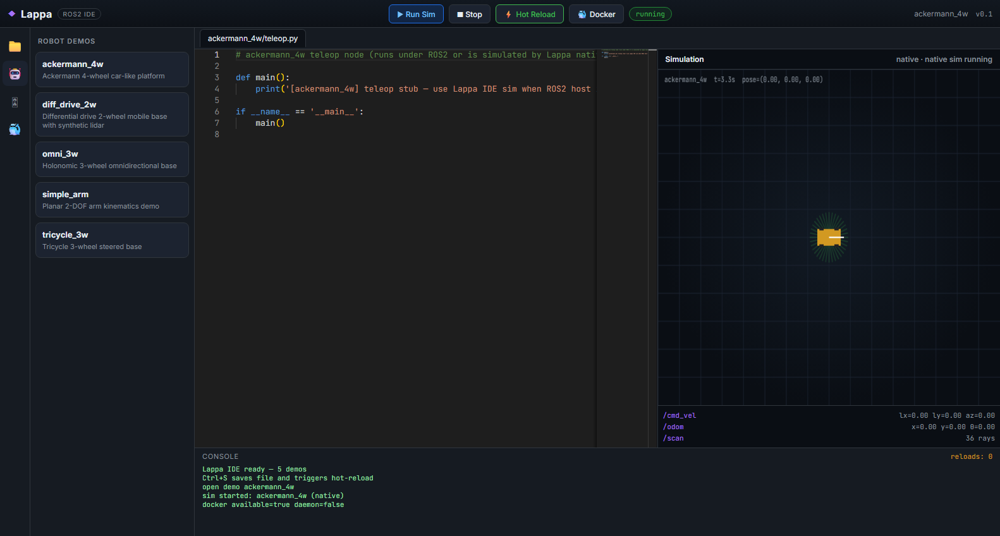
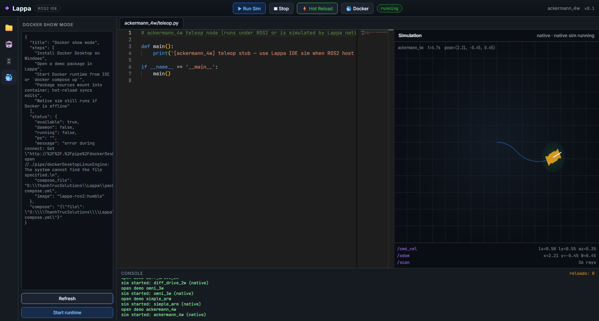
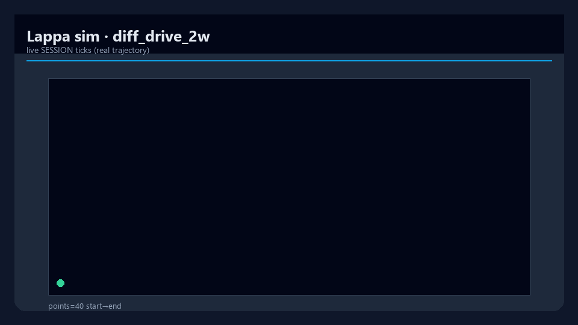
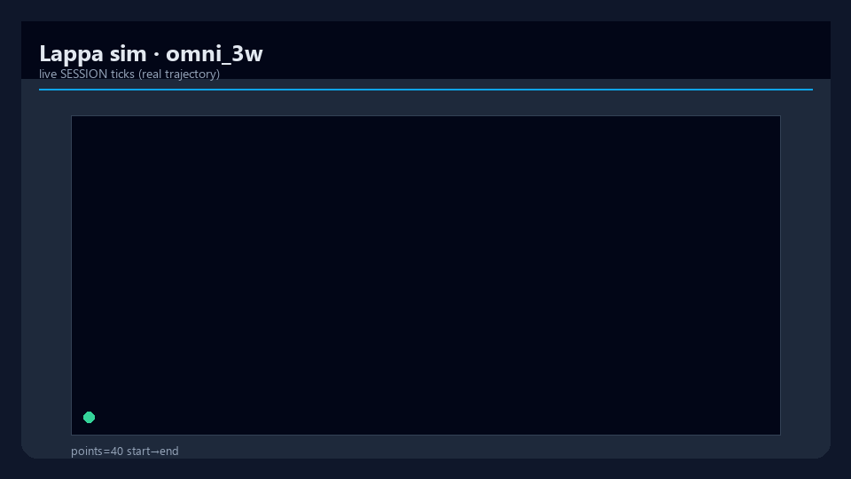
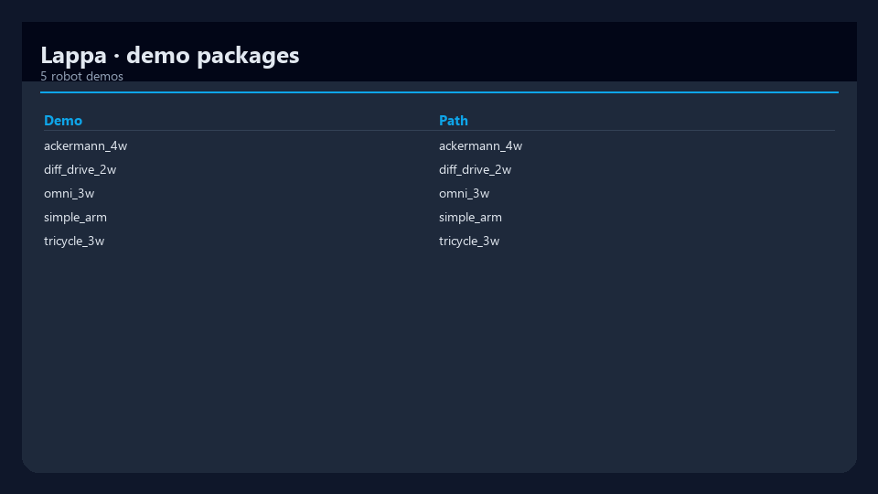

# Lappa

[](https://www.python.org/downloads/)
[](packages/server/pyproject.toml)
[](LICENSE)
[](https://docs.ros.org/)
[](https://github.com/mergeos-bounties)

**Lappa** is a **ROS2 package IDE** for Windows-first (and Linux) workflows: open a package, edit with hot-reload, **simulate offline**, build **fitted multi-link 3D robots**, and optionally run a real ROS2 container — without installing a full ROS2 desktop on the host.

| Layer | Role |
| --- | --- |
| **Lappa IDE** | Browser IDE — Monaco editor, explorer, teleop, **2D / WebGL 3D** sim, package bundler, 3D model lab |
| **Lappa Server** | CLI + FastAPI — workspace, multi-distro ROS2, packager, mesh fit, native kinematics, Docker bridge |
| **Demos** | Colcon-ready packages: diff-drive, omni, tricycle, ackermann, planar arm (+ meshes & URDF) |
| **Docker runtime** | Optional show mode: **Humble / Iron / Jazzy / Kilted / Rolling** |

**Org:** [mergeos-bounties/Lappa](https://github.com/mergeos-bounties/Lappa) · MergeOS project `prj_0352` · **MIT**

---

## Table of contents

- [Highlights](#highlights)
- [Screenshots](#screenshots)
- [Desktop GUI (Qt)](#desktop-gui-qt)
- [Diagrams](#diagrams)
- [Architecture](#architecture)
- [Quick start](#quick-start)
- [CLI reference](#cli-reference)
- [Robot demos](#robot-demos)
- [3D stack (v0.3)](#3d-stack-v03)
- [ROS2 versions](#ros2-versions)
- [Package bundles](#package-bundles)
- [HTTP API](#http-api)
- [Docker (optional)](#docker-optional)
- [Download binaries](#download-binaries)
- [Repository layout](#repository-layout)
- [Development](#development)
- [Roadmap](#roadmap)
- [MergeOS bounties](#mergeos-bounties)
- [License](#license)

---

## Highlights

| Capability | What you get |
| --- | --- |
| **Offline native sim** | Diff-drive, omni, tricycle, ackermann, arm — pose, twist, synthetic lidar, **wheel joint odometry** |
| **Full 3D (v0.3)** | Auto-fit mesh AABB, multi-link robots (chassis + wheels + lidar), clean URDF, WebGL orbit viewer |
| **No host ROS2 required** | Demos run without installing ROS2 desktop on Windows/Linux host |
| **Multi-distro targets** | Humble · Iron · Jazzy · Kilted · Rolling — Dockerfiles rewrite for the selected distro |
| **Package bundler** | Zip one or many packages with `lappa_manifest.json` for colcon |
| **Hot reload** | File watch → sim session notified when you save in the IDE |
| **Docker show mode** | Optional container mount + runtime when Docker Desktop is available |
| **Professional IDE** | Activity bar, split panes, dark theme, teleop (WASD), 2D/3D toggle |

---

## Screenshots

Captures from live product demos and the IDE.

| IDE & Docker | Mobile base sims |
| :---: | :---: |
|  |  |
| *IDE overview — explorer, Monaco, sim* | *Differential drive 2W* |
|  |  |
| *Docker show mode panel* | *Holonomic omni 3W* |

| More robots | Trajectories & packages |
| :---: | :---: |
|  |  |
| *Tricycle / steered base* | *Live trajectory · diff drive* |
|  |  |
| *Planar arm FK* | *Live trajectory · omni* |
| |  |
| | *Demo package list (CLI/API)* |

> **3D WebGL:** after `lappa model build-robot <demo>` (or IDE → Models → **Build full 3D robot**), open the sim panel and switch **2D → 3D** for orbit view of chassis, wheels, and lidar.

---


## Desktop GUI (Qt)

Modern **PySide6** shell for simulation, demos, 3D models, package bundles, and ROS2/Docker — native desktop (alongside the browser IDE).

```powershell
cd packages\server
pip install -e ".[gui]"
lappa-gui
# or: lappa gui
```

<p align="center">
  
</p>

*Simulation + teleop canvas*

<p align="center">
  
</p>

*Robot demos*

<p align="center">
  
</p>

*3D mesh library & build-robot*

<p align="center">
  
</p>

*Package bundles*

<p align="center">
  
</p>

*ROS2 distro & Docker status*


## Diagrams

System architecture and workflow — shown full-width below.  
Open the HTML files for **dark/light theme toggle** and export (PNG/SVG).

### Architecture

[Open interactive diagram](docs/diagrams/architecture.html)

<p align="center">
  
</p>

### Workflow

[Open interactive diagram](docs/diagrams/workflow.html)

<p align="center">
  
</p>

*Generated with [archify](https://github.com/tt-a1i).*

## Architecture

```text
┌─────────────────────────────────────────────────────────────┐
│  Browser IDE  (packages/ide)                                │
│  Monaco · Explorer · Teleop · 2D canvas · Three.js 3D       │
└───────────────────────────┬─────────────────────────────────┘
                            │ HTTP /api/*
┌───────────────────────────▼─────────────────────────────────┐
│  Lappa Server  (packages/server)                            │
│  · workspace / files / hot-reload                           │
│  · native kinematics engines                                │
│  · models3d: fit · attach · build-robot · scene3d           │
│  · packager + ros2 version store                            │
│  · docker_bridge                                            │
└───────────┬─────────────────────────────┬───────────────────┘
            │                             │
   packages/demos/*              packages/docker (optional)
   (URDF + meshes + launch)      ros:humble|jazzy|…
```

**Coordinate frames (3D):** ROS REP-103 — *x* forward, *y* left, *z* up. The WebGL viewer maps ROS → Three.js (Y-up) automatically.

---

## Quick start

### From source (recommended for development)

**Windows (PowerShell):**

```powershell
cd packages\server
python -m venv .venv
.\.venv\Scripts\activate
pip install -e ".[dev,api]"

lappa version
lappa demo
lappa serve --port 8840
# or open browser automatically:
lappa desktop
```

**Linux / macOS:**

```bash
cd packages/server
python -m venv .venv
source .venv/bin/activate
pip install -e ".[dev,api]"
lappa demo
lappa serve --port 8840
```

Open **http://127.0.0.1:8840** — demos load in the explorer; press **▶ Run Sim** and teleop with WASD / QE (strafe).

### Offline smoke demo

```text
$ lappa demo
demos: 5  (ackermann_4w, diff_drive_2w, omni_3w, simple_arm, tricycle_3w)
3d_robot: diff_drive_2w · links=5 · scene_nodes=4
bundle + trajectory CSV · Lappa demo complete
```

---

## CLI reference

| Command | Description |
| --- | --- |
| `lappa version` | Package version |
| `lappa demo` | Offline smoke: all engines + 3D robot build + bundle + trajectory |
| `lappa serve [--host] [--port] [--open]` | FastAPI + static IDE |
| `lappa desktop` | Serve and open the system browser |
| `lappa demos list` | List robot demos |
| `lappa workspace open <path\|demo>` | Set active package |
| `lappa sim start --demo <id>` | Start native sim session |
| `lappa sim status` | Session status |
| `lappa ros2 list \| set \| get` | Target ROS2 distro |
| `lappa package list \| bundle \| bundles` | Colcon-ready zip packs |
| `lappa model presets \| create \| list` | Procedural OBJ library |
| `lappa model fit` | Auto-scale mesh AABB to a target box |
| `lappa model attach` | Fit-attach mesh onto a package link / URDF |
| `lappa model build-robot` | Full multi-link robot (chassis + wheels + lidar) |
| `lappa model scene` | Print `scene3d` JSON for a package |
| `lappa docker status` | Docker availability / distro |

```powershell
lappa demos list
lappa workspace open demos/diff_drive_2w
lappa sim start --demo diff_drive_2w
lappa ros2 set jazzy
lappa package bundle -p diff_drive_2w -p omni_3w --distro humble
lappa model build-robot diff_drive_2w
lappa model scene diff_drive_2w
```

---

## Robot demos

Each entry under `packages/demos/` is a **ROS2-style package** (`package.xml`, `launch/`, `urdf/`, Python nodes, `meshes/`).

| Id | Kinematics | 3D layout (`build-robot`) | Notes |
| --- | --- | --- | --- |
| `diff_drive_2w` | Differential drive | Chassis + L/R wheels + lidar | Classic mobile base |
| `omni_3w` | Holonomic 3-wheel | Chassis + 3 wheels @ 120° + lidar | Strafe + rotate |
| `tricycle_3w` | Tricycle | Chassis + steer + rear pair + lidar | Steering geometry |
| `ackermann_4w` | Ackermann car-like | Chassis + 4 wheels + lidar | Wheelbase + steer |
| `simple_arm` | Planar 2-DOF | Base + link1 + link2 | Joint angles / FK tip |

Sim state includes `x, y, theta`, `twist`, synthetic `lidar`, and **`joints`** (wheel spin / arm angles) for the 3D viewer.

---

## 3D stack (v0.3)

Lappa treats 3D as a first-class workflow: **generate → fit → assemble → view → bundle**.

### Mesh library & auto-fit

| Preset | Use |
| --- | --- |
| `box` | Generic body |
| `cylinder` | Pillar / vertical body |
| `sphere` | Ball / joint hint |
| `wheel` | Thin cylinder (Y-axis spin) |
| `chassis` | Mobile base plate |
| `arm_link` | Elongated arm segment |
| `lidar_dome` | Hemisphere sensor |

```powershell
# Create procedural OBJ in the workspace mesh library
lappa model create chassis -n my_chassis
lappa model create wheel -n my_wheel

# Khớp kích thước: scale AABB → target box, center at origin
lappa model fit my_chassis --sx 0.42 --sy 0.30 --sz 0.10

# Safe attach: upsert visual on base_link (no duplicate base_link_mesh spam)
lappa model attach diff_drive_2w my_chassis --auto-fit --link base_link
```

**Fit semantics**

1. Parse OBJ vertices → axis-aligned bounding box (AABB).  
2. Compute per-axis (or uniform) scale so size matches the target.  
3. Center the mesh at the origin so URDF `xyz` is a true link offset.  
4. Write fitted OBJ into `package/meshes/` and update `urdf/robot.urdf` via **visual upsert**.

### Build a full aligned robot

```powershell
lappa model build-robot diff_drive_2w
lappa model build-robot omni_3w
lappa model build-robot ackermann_4w
```

Produces:

```text
base_footprint
  └── base_link          (chassis mesh)
        ├── wheel_*      (continuous joints, kinematic xyz / yaw)
        └── lidar_link   (fixed joint)   # mobile bases
```

- Wheel centers sit on the ground plane relative to footprint height.  
- Attachments registry: `meshes/attachments.json`.  
- Valid multi-link URDF (no orphan duplicate links).

### IDE 3D viewer

1. Open a demo package.  
2. **🧊 Models** → **Build full 3D robot** (or use CLI).  
3. Sim panel → toggle **3D**.  
4. **Orbit:** drag to rotate · mouse wheel to zoom.  
5. Teleop (WASD) — wheels animate from joint odometry.

### scene3d contract

`GET /api/packages/{name}/scene3d` returns a viewer-ready graph:

```json
{
  "package": "diff_drive_2w",
  "frame": "base_footprint",
  "up": [0, 0, 1],
  "forward": [1, 0, 0],
  "nodes": [
    {
      "link": "base_link",
      "mesh_url": "/api/packages/diff_drive_2w/mesh/diff_drive_2w_chassis.obj",
      "xyz": [0, 0, 0],
      "rpy": [0, 0, 0],
      "scale": [1, 1, 1],
      "role": "chassis",
      "bounds": { "size": [0.42, 0.3, 0.1], "center": [0, 0, 0] }
    }
  ]
}
```

---

## ROS2 versions

```powershell
lappa ros2 list
lappa ros2 set jazzy
lappa ros2 get
```

| Id | Image | Notes |
| --- | --- | --- |
| `humble` | `ros:humble-ros-base` | Default LTS (Ubuntu 22.04) |
| `iron` | `ros:iron-ros-base` | Legacy |
| `jazzy` | `ros:jazzy-ros-base` | LTS Ubuntu 24.04 |
| `kilted` | `ros:kilted-ros-base` | Interim |
| `rolling` | `ros:rolling-ros-base` | Bleeding edge |

In the IDE: **title bar → ROS2 dropdown**. Starting Docker regenerates `packages/docker/Dockerfile` for the selected distro.

---

## Package bundles

```powershell
lappa package list
lappa package bundle -p diff_drive_2w -p omni_3w --distro humble
lappa package bundles
```

Or IDE → **📦 Package** → select packages → **Create bundle zip**.

Artifacts live under the server workspace (e.g. `.workspaces/bundles/`).

```text
src/<pkg>/...          # package sources including meshes/ + urdf/
lappa_manifest.json    # distro, packages, Lappa version
README_BUNDLE.md
```

---

## HTTP API

Base URL when serving: `http://127.0.0.1:8840`

| Method | Path | Purpose |
| --- | --- | --- |
| `GET` | `/health` | Health + version + demos |
| `GET` | `/api/demos` | Demo package list |
| `POST` | `/api/workspace/open` | Open demo / path |
| `GET` | `/api/files?path=` | Read package file |
| `PUT` | `/api/files` | Write file (hot-reload) |
| `POST` | `/api/sim/start` | Start native sim |
| `POST` | `/api/sim/cmd` | Publish twist |
| `GET` | `/api/sim/state` | Pose / joints / lidar |
| `GET` | `/api/sim/trajectory.csv` | Trajectory export |
| `GET` | `/api/ros2/versions` | Distro list + selected |
| `POST` | `/api/packages/bundle` | Create zip bundle |
| `GET` | `/api/models/presets` | Mesh presets |
| `POST` | `/api/models` | Create procedural mesh |
| `POST` | `/api/models/fit` | Auto-fit library mesh |
| `POST` | `/api/models/attach` | Fit-attach to package |
| `POST` | `/api/models/build-robot` | Full aligned robot |
| `GET` | `/api/packages/{pkg}/scene3d` | 3D scene graph |
| `GET` | `/api/packages/{pkg}/mesh/{file}` | Raw OBJ for WebGL |
| `GET` | `/api/docker/status` | Docker probe |

---

## Docker (optional)

Requires [Docker Desktop](https://www.docker.com/products/docker-desktop/) (or a Docker engine on Linux).

```powershell
# From repository root
docker compose -f packages/docker/docker-compose.yml up --build
# or IDE → Docker → Start runtime
```

Without Docker, the **native kinematics sim** still runs fully offline. Docker is for real `ros2 launch` / distro fidelity.

---

## Download binaries

GitHub Releases ship standalone builds (no Python install):

| File | Platform |
| --- | --- |
| `lappa-windows-x64.exe` | Windows 10/11 x64 |
| `lappa-linux-x64` | Linux x64 |

```powershell
.\lappa-windows-x64.exe          # opens http://127.0.0.1:8840
.\lappa-windows-x64.exe demo
```

```bash
chmod +x lappa-linux-x64
./lappa-linux-x64
./lappa-linux-x64 ros2 list
```

**Local release build:** see [docs/RELEASE.md](docs/RELEASE.md).

```powershell
pwsh scripts\build_release.ps1
# → dist\release\lappa-windows-x64.exe
```

```bash
bash scripts/build_release.sh
# → dist/release/lappa-linux-x64
```

Tag `v*` on GitHub → Actions builds both OS assets.

---

## Repository layout

```text
Lappa/
├── packages/
│   ├── server/          # Python CLI + FastAPI (lappa)
│   │   ├── src/lappa/   # api, models3d, sim, packager, docker_bridge
│   │   └── tests/
│   ├── ide/             # Static IDE (index.html, ide.js, ide.css)
│   ├── demos/           # ROS2-style robot packages + meshes/URDF
│   └── docker/          # Dockerfile, compose, entrypoint
├── docs/
│   ├── screenshots/     # README gallery
│   ├── BOUNTY.md
│   ├── RELEASE.md
│   └── ROADMAP.md
├── scripts/             # release builds, bounties, screenshots
└── README.md
```

---

## Development

```powershell
cd packages\server
pip install -e ".[dev,api]"
pytest -q
ruff check src tests
lappa demo
```

| Area | Path |
| --- | --- |
| 3D fit / URDF / scene | `src/lappa/models3d.py` |
| Kinematics engines | `src/lappa/sim/engines.py` |
| HTTP API | `src/lappa/api.py` |
| IDE client | `packages/ide/assets/ide.js` |
| Demo packages | `packages/demos/*` |

---

## Roadmap

| Version | Status | Focus |
| --- | --- | --- |
| **v0.1** | Shipped | IDE shell, native sim, demos, Docker scaffold |
| **v0.2** | Shipped | Multi-distro ROS2, packager, procedural meshes, trajectory CSV |
| **v0.3** | Shipped | Mesh auto-fit, multi-link robots, scene3d, WebGL viewer |
| **v0.4** | Planned | Live Docker `ros2 launch`, topic graph, external OBJ/STL import |
| Later | — | Gazebo/Ignition, Foxglove/rosbridge, desktop shell |

Details: [docs/ROADMAP.md](docs/ROADMAP.md).

---

## MergeOS bounties

Contribute scrapers, sim features, IDE UX, or docs — earn **MRG** after merge.

1. Star this repo and [mergeos](https://github.com/mergeos-bounties/mergeos)  
2. Claim a `bounty` issue on Lappa  
3. Claim on MergeOS [Claim Token #1](https://github.com/mergeos-bounties/mergeos/issues/1)  
4. Open a PR to **`master`** with tests / evidence  
5. Maintainer merges → ledger credit **25 / 50 / 100 / 200 MRG**

Policy: [docs/BOUNTY.md](docs/BOUNTY.md).

---

## Tiếng Việt (tóm tắt)

**Lappa** là IDE gói ROS2: sửa code, hot-reload, **mô phỏng offline** (không cần cài ROS2 trên máy), **khớp mesh 3D** (auto-fit AABB), **build robot nhiều link** (khung + bánh + lidar), xem **WebGL 3D** trong IDE, đóng gói zip theo distro, Docker tùy chọn.

```powershell
pip install -e "packages/server.[dev,api]"
lappa demo
lappa model build-robot diff_drive_2w
lappa serve --port 8840
```

IDE: http://127.0.0.1:8840 → Models → **Build full 3D robot** → Sim → **3D**.

---

## License

[MIT](LICENSE) · © MergeOS / ThanhTrucSolutions
